# 🧮 HTML-CSS-JS-Basic-Calculator

<div align="center">


</div>

## ✨ Overview

A **visually stunning calculator** featuring **neumorphic design** principles. This modern interface combines soft shadows, rounded edges, and elegant styling to create a sleek user experience that feels tactile and interactive.

## 🎨 Design Philosophy

```mermaid
graph LR
    A[🎨 Neumorphic Design] --> B[💫 Soft Shadows]
    A --> C[🔘 Rounded Edges]
    A --> D[✨ Extruded Look]
    A --> E[🌟 Modern Aesthetic]
    
    style A fill:#FF6B6B,stroke:#fff,stroke-width:2px,color:#fff
    style B fill:#4ECDC4,stroke:#fff,stroke-width:2px,color:#fff
    style C fill:#45B7D1,stroke:#fff,stroke-width:2px,color:#fff
    style D fill:#96CEB4,stroke:#fff,stroke-width:2px,color:#fff
    style E fill:#FECA57,stroke:#fff,stroke-width:2px,color:#fff
```

<div align="center">



</div>

## 🚀 Key Features

<table>
<tr>
<td width="50%">

### 🎯 **Design Features**
 Minimalist & Elegant  
 Cross-Device Compatible  
 Smooth Transitions  
 Contemporary Look  

</td>
<td width="50%">

### ⚡ **Functionality**
 Basic Operations  
 Styled Output  
 Tactile Feedback  
 Instant Calculations  

</td>
</tr>
</table>

## 🎨 Visual Showcase

<div align="center">

### 🔢 **Calculator Operations**

| Operation | Symbol | Status |
|-----------|--------|--------|
| **Addition** | ➕ |  |
| **Subtraction** | ➖ |  |
| **Multiplication** | ✖️ |  |
| **Division** | ➗ |  |

</div>

## 🛠️ Tech Stack

<div align="center">

| **Frontend** | **Styling** | **Interactivity** |
|:---:|:---:|:---:|
|  |  |  |
| Structure | Neumorphic Design | Logic & Events |

</div>

## 🎯 Design Highlights

<div align="center">

### 🌈 **Neumorphic Elements**

```
🔘 Extruded Buttons    💫 Soft Shadows    ✨ Smooth Transitions
🖥️ LCD-Style Display   🎨 Modern Colors   📱 Mobile Friendly
```


</div>

## 🚀 Quick Start

```bash
# Clone the repository
git clone https://github.com/MudasirNaeem1/HTML-CSS-JS-Basic-Calculator.git

# Navigate to project
cd HTML-CSS-JS-Basic-Calculator

# Open in browser
open index.html
```

## 📱 Features Breakdown

<details>
<summary>🎨 <strong>Design Features</strong></summary>

- **Neumorphic UI**: Soft, extruded appearance with depth
- **Responsive Layout**: Works on desktop, tablet, and mobile
- **Modern Typography**: Clean, readable number display
- **Color Harmony**: Carefully selected color palette
- **Accessibility**: High contrast and clear visual hierarchy

</details>

<details>
<summary>⚡ <strong>Interactive Elements</strong></summary>

- **Button Hover Effects**: Visual feedback on interaction
- **Smooth Animations**: CSS transitions for fluid experience
- **Touch-Friendly**: Optimized for mobile touch interactions
- **Visual States**: Active, hover, and focus states
- **Error Handling**: Graceful handling of edge cases

</details>

<details>
<summary>🔢 <strong>Calculator Functions</strong></summary>

- **Basic Operations**: +, -, ×, ÷
- **Clear Function**: Reset calculations
- **Decimal Support**: Handle floating-point numbers
- **Real-time Display**: Instant visual feedback
- **Keyboard Support**: Use keyboard for input

</details>

## 🎨 Color Palette

<div align="center">

| Color | Usage | Hex |
|-------|-------|-----|
|  | Background | `#E0E5EC` |
|  | Highlights | `#FFFFFF` |
|  | Shadows | `#A3B1C6` |
|  | Text | `#333333` |

</div>

## 📊 Project Stats

<div align="center">


</div>

## 🌟 Live Demo

<div align="center">


*Experience the neumorphic design in action!*

</div>

## 📞 Connect & Support

<div align="center">

[](https://www.linkedin.com/in/mudasir-naeem-698679303)
[](https://github.com/MudasirNaeem1)
[](mailto:mudasirnaeem000@gmail.com)

---

### 🎨 *"Design is not just what it looks like - design is how it works"*


</div>
